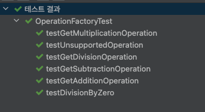
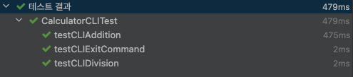

# 📌 Calculator Application (CLI & Web API)

## **📖 개요**
이 프로젝트는 **CLI 모드와 Web API 모드를 동시에 지원하는 계산기 애플리케이션**입니다.  
기본적인 사칙연산 (`+`, `-`, `*`, `/`)을 제공하며, CLI 및 REST API를 통해 연산을 수행할 수 있습니다.

## **🚀 기능**
### ✅ **CLI 모드**
- 명령어 입력을 통한 사칙연산 수행 (`3 + 5` → `8.0` 출력)
- 잘못된 입력 처리 (`3 ^ 5` → `Error: Unsupported operation` 출력)
- `exit` 입력 시 프로그램 종료

### ✅ **REST API 모드**
- `POST /calculator/compute`
- JSON 요청을 통해 연산 수행
- 예외 처리 (지원되지 않는 연산자, 0으로 나누기 등)

## **📂 프로젝트 구조**
```plaintext
calculator/
├── src/
│   ├── main/
│   │   ├── java/com/calculator/calculator/
│   │   │   ├── CalculatorApplication.java  # 메인 애플리케이션 실행
│   │   │   ├── calculatorcli/
│   │   │   │   └── CalculatorCLI.java      # CLI 모드 실행
│   │   │   ├── controller/
│   │   │   │   └── CalculatorController.java  # REST API 컨트롤러
│   │   │   ├── service/
│   │   │   │   └── CalculatorService.java  # 연산 처리 서비스
│   │   │   ├── operation/
│   │   │   │   ├── Addition.java            # 덧셈 연산
│   │   │   │   ├── Subtraction.java         # 뺄셈 연산
│   │   │   │   ├── Multiplication.java      # 곱셈 연산
│   │   │   │   ├── Division.java            # 나눗셈 연산
│   │   │   │   ├── Operation.java           # 연산 인터페이스
│   │   │   │   ├── OperationFactory.java    # 연산자 매핑
│   └── test/java/com/calculator/calculator/
│       ├── CalculatorApplicationTests.java  # 메인 애플리케이션 테스트
│       ├── calculatorcli/
│       │   └── CalculatorCLITests.java      # CLI 모드 테스트
│       ├── controller/
│       │   └── CalculatorControllerTests.java  # REST API 테스트
│       ├── service/
│       │   └── CalculatorServiceTests.java  # 연산 로직 테스트
│       ├── operation/
│       │   └── OperationFactoryTest.java    # 연산자 매핑 테스트
```

## 🔧 실행 방법
### 1️⃣ CLI 모드 실행
```angular2html
./gradlew build
java -jar build/libs/calculator-0.0.1-SNAPSHOT.jar cli
```
### 📌 CLI 실행 후 입력 예시:
```angular2html
CLI Calculator started. Enter 'exit' to quit.
Enter operation (ex: 3 + 5): 3 + 5
Result: 8.0
Enter operation (ex: 3 + 5): exit
Exiting CLI...
```

### 2️⃣ REST API 실행
```angular2html
./gradlew build
java -jar build/libs/calculator-0.0.1-SNAPSHOT.jar
```

### 📌 API 요청 예시:
```angular2html
curl -X POST "http://localhost:8080/calculator/compute" \
-H "Content-Type: application/json" \
-d '{"operation1": 10, "operation2": 2, "operator": "/"}'
```

### 📌 응답:
```angular2html
5.0
```

## 🛠️ 테스트 실행

```angular2html
./gradlew test
```

### 📌 실행되는 테스트 목록:

```angular2html
CalculatorCLITests → CLI 모드 테스트
OperationFactoryTests → 연산자 매핑 검증
```

### 테스트 실행 예시



